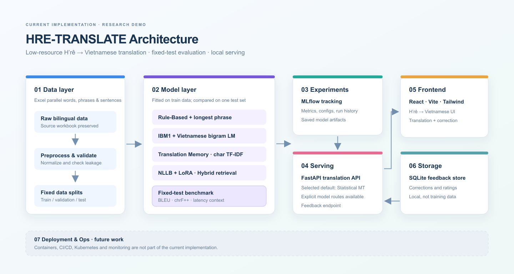

# HRE-TRANSLATE

Low-resource H’rê ↔ Vietnamese machine translation, built as a reproducible research platform and local product demo.

## Architecture

The diagram shows implemented components; deployment and monitoring are labeled as future work. [Editable SVG](docs/images/architecture.svg) and the supplied concept image in `ui/` are retained as references.

## Overview

HRE-TRANSLATE compares lexical, statistical, retrieval, and neural translation on one fixed held-out test set. FastAPI serves the selected default through a focused React interface, while MLflow records local experiments. This is a research demo, not a validated production translator.

## Translation approaches

- Rule-Based: normalized dictionary lookup, longest phrase match, copied unknowns.
- Statistical MT: independent directional IBM Model 1 models, target-language smoothed bigram LMs, and beam decoders.
- Translation Memory: train-only character TF-IDF retrieval.
- Neural / pretrained: NLLB-200 distilled 600M with a LoRA adapter.
- Hybrid retrieval: train-only dictionary/TM routing and conservative neural post-editing.

## Model comparison

All rows use the same 160 held-out test pairs. The table below is H’rê → Vietnamese only. Scores are corpus BLEU and chrF++ (SacreBLEU); details and the reproducible sample are in [model_comparison.csv](artifacts/evaluation/model_comparison.csv) and [model_outputs.csv](artifacts/evaluation/model_outputs.csv).

| Model | BLEU | chrF++ | Avg / median latency (ms) |
|---|---:|---:|---:|
| Statistical MT + bigram LM | 6.277 | 23.060 | 0.532 / 0.233 |
| IBM Model 1 | 4.249 | 20.719 | 0.272 / 0.141 |
| Translation Memory | 4.553 | 17.809 | 35.036 / 34.643 |
| Rule-Based | 2.331 | 11.724 | 0.047 / 0.032 |
| Full hybrid | 1.739 | 9.176 | Not measured end-to-end |
| NLLB + LoRA | 0.435 | 5.880 | 273.076 / 158.469 (Kaggle T4) |

Statistical MT is the selected default by chrF++; this is not a claim of general superiority beyond this small test set. The full CSV includes the dictionary and neural ablations. NLLB uses verified Kaggle predictions; hybrid replays those predictions with local retrieval. Neural latency was measured on different hardware and is not directly comparable.

For Vietnamese → H’rê, independently trained Statistical MT scored BLEU 3.179 and chrF++ 25.837 on the same fixed 160 test pairs (mean/median latency 0.829/0.721 ms). See [reverse results](artifacts/evaluation/vi_to_hre_results.csv) and [seeded examples](artifacts/evaluation/vi_to_hre_examples.csv). Scores across directions are not directly comparable; the small H’rê bigram LM limits fluency.

## Tech stack

Python, pandas, scikit-learn, SacreBLEU, PyTorch, Transformers, PEFT, FastAPI, SQLite, MLflow, React, TypeScript, Vite, Tailwind CSS.

## Run locally

Use Python 3.11 or 3.12 and Node.js/npm. First setup from the repository root:

    conda run -n hre-translate-stage1 python -m pip install -e ".[dev,serve]"
    npm install

Then run both services with one command; PowerShell Conda activation is not required:

    npm run dev

Open http://127.0.0.1:5173 and use **Swap languages** for H’rê ↔ Vietnamese. The API runs at http://127.0.0.1:8000; copy `apps/web/.env.example` to `apps/web/.env.local` to customize `VITE_API_URL`. Stop both with Ctrl+C. If port 8000 is already in use, stop the older API process first. API docs are at http://127.0.0.1:8000/docs. Example:

    curl.exe -X POST http://127.0.0.1:8000/translate -H "Content-Type: application/json" --data-binary '{"text":"Lăm kleq kô pa zâu","model":"default"}'

    curl.exe -X POST http://127.0.0.1:8000/translate -H "Content-Type: application/json" --data-binary '{"text":"một","source":"vi","target":"hre"}'

`auto`/`default` use directional defaults in `configs/serving.yaml`; reverse currently supports statistical/IBM1 only. Regenerate directional artifacts and evaluation with `python scripts/train_statistical_bidirectional.py`. Explicit forward-only alternatives remain available through the API. Feedback is stored locally in SQLite and never automatically added to training. NLLB weights are Git-ignored and require the local adapter plus base model.

Install optional neural and tracking dependencies only when needed: `python -m pip install -e ".[neural,tracking]"`. For MLflow:

    python -m mlflow ui --backend-store-uri sqlite:///mlflow.db --host 127.0.0.1 --port 5000

## Project structure

    apps/web/     React demo
    configs/      Model, benchmark, and serving settings
    data/         Original, processed, and fixed split data
    docs/images/  Current architecture diagram
    src/          Translation, evaluation, tracking, and API code
    scripts/      Benchmark and training entrypoints
    tests/        Python tests
    artifacts/    Model and evaluation outputs

## Future work

- Improve H’rê coverage and add independent translation quality review.
- Test new neural initialization strategies on the unchanged split.
- Repeat all latency measurements on one machine before deployment claims.
- Add authentication and deployment infrastructure only after model quality improves.
